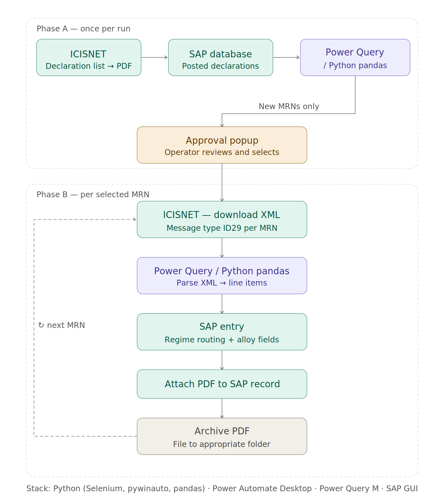

# IMA - Import Declaration Automation

End-to-end automation of the full import declaration lifecycle: data retrieval from two government systems, XML parsing, SAP posting, PDF attachment and file archiving.


## Workflow



The workflow exists in two implementations:

| File | Stack | Approach |
|------|-------|---------|
| `IMA.robin` | Power Automate Desktop + Power Query M | PAD orchestrates UI interactions; Excel/PQ acts as the data reconciliation and XML parsing engine |
| `IMA-IMC.py` | Python (Selenium, pywinauto, pandas, tkinter) | Single Python orchestrator; Selenium drives the browser, pywinauto drives SAP GUI, pandas handles all data logic |


---

## Python Implementation (IMA-IMC.py)

### Architecture

```
main()
├── ask_start_mode()          # Startup dialog: full / PDF-only / from saved results
│
├── phase_a_icisnet()         # Selenium → ICISNET → declarations DataFrame
├── phase_a_sap_export()      # pywinauto → SAP LIST_N → ΕΙΣΑΓΩΓΕΣ_database.xlsx
├── phase_a_queries()         # pandas: ICISNET vs SAP diff → FULL_RESULTS.xlsx
│                             #         (sheets: opened / done / undone)
│
├── ApprovalPopup             # tkinter table — checkbox select, inline edit
│   └── .run() → selected[]
│
└── process_mrn() [per MRN]
    ├── phase_b_download_xml()   # Selenium → ICISNET → current.xml
    ├── phase_b_parse_xml()      # xml.etree → df_result (all line items)
    ├── expand_krammata()        # splits lines by alloy count (1–3)
    ├── sap_entry()              # pywinauto → ZELVMM_IMP_1 → keyboard entry
    └── sap_attach()             # pywinauto → ZGOS_ZIMP1 → attach PDF
```

### Key design decisions

**Single browser session for Phase B.** ICISnet login happens once before the MRN loop; the driver is passed between calls. This avoids repeated login overhead and session timeouts.

**Approval popup before Phase B.** A tkinter table shows all pending MRNs with editable fields (PROT, PDF filenames, alloy codes for customs office 0832). The operator can deselect MRNs, correct filenames, and pre-fill alloy data before automation starts.

**Alloy expansion for multi-alloy declarations.** Customs office 0832 requires one SAP line per alloy. If a declaration has multiple alloys, `expand_krammata()` duplicates the declaration row — one copy per alloy — so the SAP entry loop treats each as a separate posting.

**Three startup modes.** Mode 1 runs the full pipeline. Mode 2 reads a previously saved ICISNET PDF (avoids re-scraping). Mode 3 loads an existing FULL_RESULTS.xlsx directly — useful when resuming after a partial run.

---

## PAD Implementation (IMA.robin)

The PAD flow covers the same phases using Power Automate Desktop actions and Power Query as the data engine.

Key differences from the Python version:
- UI interactions use PAD's built-in `UIAutomation` and `WebAutomation` actions with element masks
- The reconciliation engine runs inside an Excel workbook (Power Query M) rather than in-memory pandas
- XML parsing is also handled by Power Query (sheet "info") rather than `xml.etree`
- Alloy count and type are prompted via PAD `Display.InputDialog` rather than a custom tkinter popup

---

## Systems Involved

| System | Role |
|--------|------|
| **ICISNET** (AADE) | Greek Customs web portal — declaration list and XML messages |
| **SAP GUI** | ERP — LIST_N (export) and ZELVMM_IMP_1 (import posting) |
| **ZGOS_ZIMP1** | SAP custom transaction — PDF attachment |
| **Power Query / pandas** | Reconciliation engine and XML parsing |
| **PAD / Python** | Orchestrator |

---

## Tech Stack

**Python implementation:** Python, Selenium, pywinauto, pandas, openpyxl, tkinter, pdfplumber

**PAD implementation:** Power Automate Desktop, Power Query M, SAP GUI, Web Automation (Chrome)
