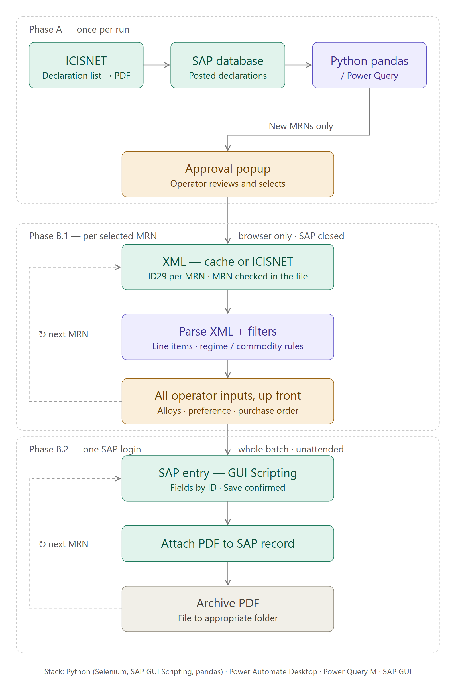

# IMA - Import Declaration Automation

End-to-end automation of the full import declaration lifecycle: data retrieval from two government systems, XML parsing, SAP posting, PDF attachment and file archiving.


## Workflow



The workflow exists in two implementations:

| File | Stack | Approach |
|------|-------|---------|
| `IMA.robin` | Power Automate Desktop + Power Query M | PAD orchestrates UI interactions; Excel/PQ acts as the data reconciliation and XML parsing engine |
| `IMA-IMC.py` | Python (Selenium, SAP GUI Scripting, pandas, tkinter) | Single Python orchestrator; Selenium drives the browser, the SAP GUI Scripting API drives SAP, pandas handles all data logic |

SAP is driven through the **SAP GUI Scripting API** — every field is written by its element ID, so the run does not depend on window focus, tab order or timing.

---

## How it evolved

The same process has been automated three times, each step removing a class of failures:

| | PAD flow | Python + pywinauto | Python + SAP GUI Scripting (current) |
|---|---|---|---|
| **SAP input** | Recorded clicks and `SendKeys` with `{Tab}` sequences | Keystrokes into the focused window | Each field set by element ID; buttons pressed by ID |
| **Breaks when…** | a window steals focus, a screen loads slowly, a field moves | the operator touches the PC during the run | the screen itself changes (detected and stopped) |
| **Save confirmation** | none — assumes success | none | status bar checked after every Save |
| **Operator questions** | interrupt the run per declaration | interrupt the run per declaration | all asked up front; posting runs unattended |
| **SAP logins** | one per declaration | one per declaration | one per batch |
| **XML downloads** | every run | every run | cached per MRN, verified against the file |
| **Credentials** | typed into the flow | in the source | Windows Credential Manager |
| **Troubleshooting** | none | console output | file log with per-step timing + screenshot on error |

The previous Python version (pywinauto) is available in the commit history.

---

## Python Implementation (IMA-IMC.py)

### Architecture

```
main()
├── ask_start_mode()             # Startup dialog: full / from saved PDF / from saved results
│
├── phase_a_icisnet()            # Selenium → ICISNET → declarations DataFrame + PDF snapshot
├── phase_a_sap_export()         # SAP GUI Scripting → LIST_N → export to xlsx
├── phase_a_queries()            # pandas: ICISNET vs SAP diff → FULL_RESULTS.xlsx
│                                #         (sheets: opened / done / undone)
│
├── ApprovalPopup                # tkinter table — checkbox select, inline edit
│   └── .run() → selected[]
│
├── Phase B.1 — prepare_mrn()    # per MRN, browser only (SAP closed)
│   ├── phase_b_download_xml()   # ICISNET → xml/<MRN>.xml (skipped if cached)
│   ├── phase_b_parse_xml()      # xml.etree → line items; MRN check against the file
│   ├── filters                  # regime / commodity-code rules → skip
│   └── ItemsPopup / inputs      # ALL operator questions asked here, up front
│
└── Phase B.2 — enter_mrn()      # one SAP login for the whole batch, no popups
    ├── sap_entry()              # SAP GUI Scripting → ZELVMM_IMP_1 → fields by ID
    ├── Save + status-bar check
    ├── sap_attach()             # PDF attachment (GOS)
    └── archive                  # PDF moved to the archive share
```

### Key design decisions

**Two-part Phase B.** All browser work and every operator question happens first (B.1), for every MRN. Only then is SAP opened, once, and all postings run back-to-back without interruption (B.2). The operator answers everything in one sitting and can walk away during posting.

**XML cache.** Each declaration's XML is stored as `xml/<MRN>.xml` and is never downloaded twice. The MRN inside the file is checked against the expected one; a mismatched file is deleted and the MRN fails instead of posting wrong data.

**SAP GUI Scripting instead of keystrokes.** Fields are set with `session.findById(...).text`, buttons are pressed by ID, and every Save is confirmed from the status bar. A failure stops the SAP batch (the session is no longer trustworthy) while Phase B.1 failures only skip that MRN.

**Approval popup before Phase B.** A tkinter table shows all pending MRNs with editable fields (preference, PDF filenames). The operator can deselect MRNs and correct filenames before automation starts.

**Alloy expansion for multi-alloy declarations.** Customs office 0832 requires alloy/weight pairs per line (up to three). They are collected in B.1 and written into the same SAP line.

**Three startup modes.** Mode 1 runs the full pipeline. Mode 2 reads a previously saved ICISNET PDF (avoids re-scraping). Mode 3 loads an existing FULL_RESULTS.xlsx directly — useful when resuming after a partial run.

**Operational safety.**
- Credentials come from the Windows Credential Manager (`keyring`), never from the code.
- A system-wide mutex prevents two SAP automations from running at the same time.
- File logging with per-step timing; the log is kept only when there was an error or at least one posting.
- Screenshots are taken only on errors.

---

## PAD Implementation (IMA.robin)

The PAD flow covers the same phases using Power Automate Desktop actions and Power Query as the data engine.

Key differences from the Python version:
- UI interactions use PAD's built-in `UIAutomation` and `WebAutomation` actions with element masks
- The reconciliation engine runs inside an Excel workbook (Power Query M) rather than in-memory pandas
- XML parsing is also handled by Power Query (sheet "info") rather than `xml.etree`
- Alloy count and type are prompted via PAD `Display.InputDialog` rather than a custom tkinter popup

---

## Systems Involved

| System | Role |
|--------|------|
| **ICISNET** (AADE) | Greek Customs web portal — declaration list and XML messages |
| **SAP GUI** | ERP — LIST_N (export) and ZELVMM_IMP_1 (import posting) |
| **SAP GOS** | PDF attachment to the posted record |
| **Power Query / pandas** | Reconciliation engine and XML parsing |
| **PAD / Python** | Orchestrator |

---

## Tech Stack

**Python implementation:** Python, Selenium, SAP GUI Scripting (win32com), pandas, openpyxl, tkinter, pdfplumber, keyring

**PAD implementation:** Power Automate Desktop, Power Query M, SAP GUI, Web Automation (Chrome)
